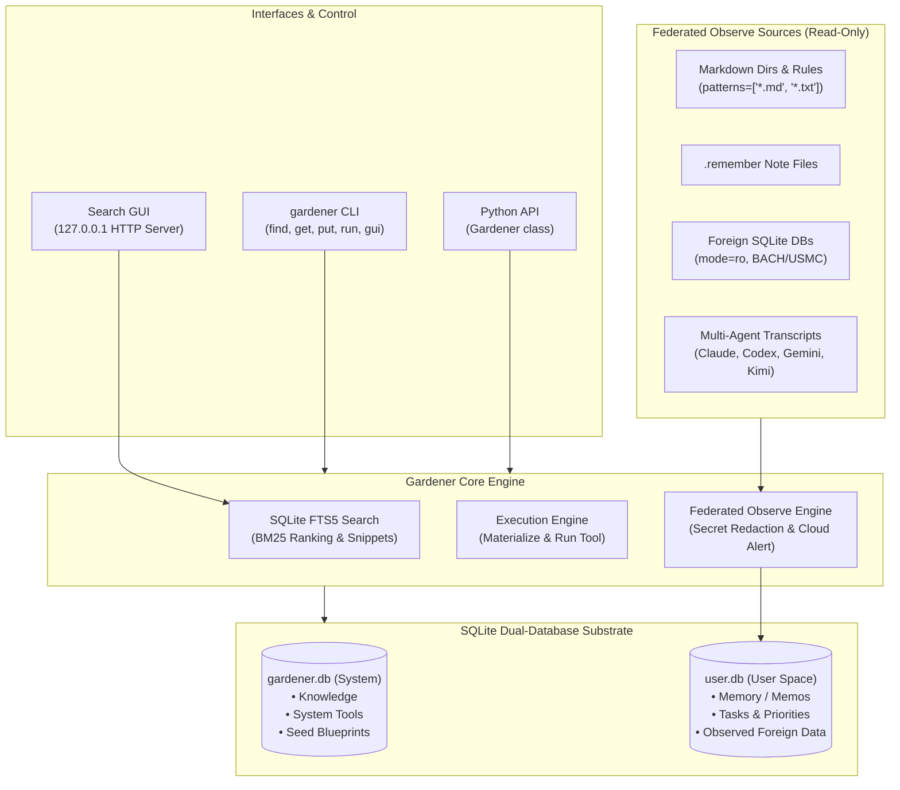
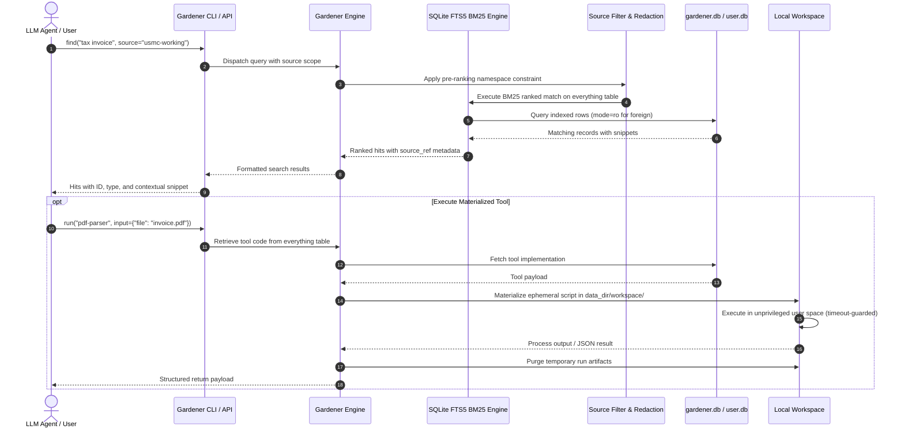

<p align="center">
  
</p>

# gardener — Database-Based OS for LLMs

[](https://github.com/ellmos-ai/gardener/actions/workflows/ci.yml)
[](https://github.com/ellmos-ai/gardener)
[](https://github.com/astral-sh/ruff)
[](https://www.python.org/)
[](https://github.com/ellmos-ai/gardener)
[](LICENSE)
[](https://github.com/ellmos-ai/gardener)
[](THIRD_PARTY_LICENSES.md)
[](SECURITY.md)
[](SECURITY.md)
[](https://github.com/ellmos-ai/gardener)
[](https://github.com/ellmos-ai)
[](https://github.com/open-bricks)
[](llms.txt)

> [!NOTE]
> **LLM / Agent Integration**: Gardener provides a single-table FTS5 SQLite substrate (`gardener.db` / `user.db`) with `find`, `get`, `put`, and `run` primitives. See [`llms.txt`](llms.txt) for machine-readable context.

**🇩🇪 [Deutsche Version](README_de.md)** | **🛡️ [Security Policy](SECURITY.md)** | **📜 [Third-Party Licenses](THIRD_PARTY_LICENSES.md)** | **📝 [Changelog](CHANGELOG.md)** | **📋 [llms.txt](llms.txt)** | **📊 [Marketing Log](MARKETING-LOG.txt)**

> Status: Prototype (v0.4.2) | Author: Lukas Geiger + Claude

---

## 🧭 Quick Navigation

| # | Section (EN) | Abschnitt (DE) | Jump Link |
|---|---|---|---|
| 01 | [Features & Core Primitives](#1-features) | [Funktionen & Kernprimitive](#1-funktionen) | [`#1-features`](#1-features) |
| 02 | [System Architecture](#2-architecture) | [Systemarchitektur](#2-architektur) | [`#2-architecture`](#2-architecture) |
| 03 | [Target Personas & Discoverability](#3-target-personas--discoverability) | [Zielgruppen & Auffindbarkeit](#3-zielgruppen--auffindbarkeit) | [`#3-target-personas--discoverability`](#3-target-personas--discoverability) |
| 04 | [Comparative Matrix vs. Alternatives](#4-comparative-matrix-vs-alternatives) | [Vergleichsmatrix vs. Alternativen](#4-vergleichsmatrix-vs-alternativen) | [`#4-comparative-matrix-vs-alternatives`](#4-comparative-matrix-vs-alternatives) |
| 05 | [Dual Mermaid Diagrams](#5-dual-mermaid-diagrams) | [Duale Mermaid-Diagramme](#5-duale-mermaid-diagramme) | [`#5-dual-mermaid-diagrams`](#5-dual-mermaid-diagrams) |
| 06 | [Governance & Runtime Invariants](#6-governance--runtime-invariants) | [Governance & Laufzeit-Invarianten](#6-governance--laufzeit-invarianten) | [`#6-governance--runtime-invariants`](#6-governance--runtime-invariants) |
| 07 | [Data Model & Everything Substrate](#7-data-model--everything-substrate) | [Datenmodell & Everything-Substrat](#7-datenmodell--everything-substrat) | [`#7-data-model--everything-substrate`](#7-data-model--everything-substrate) |
| 08 | [Dual SQLite Substrate & FTS5 BM25 Engine](#8-sqlite-substrate--fts5-engine) | [Duales SQLite-Substrat & FTS5-BM25](#8-sqlite-substrat--fts5-engine) | [`#8-sqlite-substrate--fts5-engine`](#8-sqlite-substrate--fts5-engine) |
| 09 | [Search GUI & Web Companion](#9-search-gui--web-companion) | [Such-GUI & Web-Oberfläche](#9-such-gui--web-oberflaeche) | [`#9-search-gui--web-companion`](#9-search-gui--web-companion) |
| 10 | [Installation & Quickstart](#10-installation--quickstart) | [Installation & Schnellstart](#10-installation--schnellstart) | [`#10-installation--quickstart`](#10-installation--quickstart) |
| 11 | [CLI & Headless Automation](#11-cli--headless-automation) | [CLI & Headless-Automation](#11-cli--headless-automation) | [`#11-cli--headless-automation`](#11-cli--headless-automation) |
| 12 | [Unified Task & Memory Management](#12-unified-task--memory-management) | [Einheitliches Task- & Memory-Management](#12-einheitliches-task--memory-management) | [`#12-unified-task--memory-management`](#12-unified-task--memory-management) |
| 13 | [File Lifecycle: Absorb, Materialize & Sync](#13-file-lifecycle-absorb-materialize--sync) | [Dateilebenszyklus: Absorb, Materialize & Sync](#13-dateilebenszyklus-absorb-materialize--sync) | [`#13-file-lifecycle-absorb-materialize--sync`](#13-file-lifecycle-absorb-materialize--sync) |
| 14 | [Federated Sources & Secret Redaction](#14-federated-sources--secret-redaction) | [Föderierte Quellen & Secret-Schwärzung](#14-foederierte-quellen--secret-schwaerzung) | [`#14-federated-sources--secret-redaction`](#14-federated-sources--secret-redaction) |
| 15 | [Architectural Comparison: Gardener vs. Rinnsal](#15-gardener-vs-rinnsal) | [Architekturvergleich: Gardener vs. Rinnsal](#15-gardener-vs-rinnsal) | [`#15-gardener-vs-rinnsal`](#15-gardener-vs-rinnsal) |
| 16 | [Testing & Quality Verification](#16-testing--quality-verification) | [Tests & Qualitätssicherung](#16-tests--qualitaetssicherung) | [`#16-testing--quality-verification`](#16-testing--quality-verification) |
| 17 | [Third-Party Licenses & Software Inventory](#17-third-party-licenses--software-inventory) | [Drittanbieter-Lizenzen & Software-Inventar](#17-drittanbieter-lizenzen--software-inventar) | [`#17-third-party-licenses--software-inventory`](#17-third-party-licenses--software-inventory) |
| 18 | [Security Policy, Sibling Ecosystem & Liability Notice](#18-security-policy-sibling-ecosystem--liability) | [Sicherheitsrichtlinie, Geschwister-Ökosystem & Haftungshinweis](#18-sicherheitsrichtlinie-geschwister-oekosystem--haftung) | [`#18-security-policy-sibling-ecosystem--liability`](#18-security-policy-sibling-ecosystem--liability) |

---

<a id="1-features"></a><a id="features"></a><a id="what-is-gardener"></a>
## 1. Features & Core Primitives

An operating system built specifically for LLMs. Everything lives in a searchable SQLite database. Four functions are all you need:

- **`find(query, ...)`**: Full-text search with BM25 ranking, snippet extraction, and namespace filtering across memories, tasks, knowledge, and tools.
- **`get(name)`**: Retrieve an entry by key or path, inspect metadata, and load structured state.
- **`put(name, content, ...)`**: Persist memories, lessons, tasks, documents, or executable tools directly into SQLite.
- **`run(name, input=...)`**: Ephemerally materialize and execute tool code in unprivileged user space.
- **100% Offline & Zero-Egress**: Pure standard library execution with zero network telemetry or tracking.
- **Dual SQLite Substrate**: Clean physical separation between system blueprints (`gardener.db`) and user data (`user.db`).
- **Federated Observe Ingestion**: Tail agent transcripts, markdown directories, `.remember` notes, and external SQLite tables without moving or modifying foreign data.
- **Automated Secret Redaction**: Real-time pre-index scrubbing of 13 credential families and cloud-sync leak detection.

---

<a id="2-architecture"></a><a id="architecture"></a>
## 2. System Architecture

Gardener replaces complex distributed memory microservices with a single, high-performance SQLite substrate:

```
Gardener/
  gardener.py          # Core: Gardener class + CLI engine
  sources.py           # Read-only adapters for observed foreign sources
  seed.py              # Initial system knowledge & reference sources
  search_gui.py        # Local zero-egress web search companion (127.0.0.1)
  i18n.py              # CLI internationalization & translation catalog
  locales/             # Translation strings (DE / EN)
  tests/               # Comprehensive automated contract test suite
  KONZEPT.md           # Deep architectural design document (German)
  README.md            # Canonical English specification & documentation
  README_de.md         # Canonical German specification & documentation
  THIRD_PARTY_LICENSES.md # Comprehensive software inventory & SPDX SBOM
  workspace/           # Ephemeral materialized code execution sandbox
  blobs/               # Storage repository for large binary assets (>50MB)

Local Storage (Local-First, Override with GARDENER_DATA):
  ~/.gardener/
    gardener.db        # System Substrate: Base knowledge, tools, blueprints
    user.db            # User Substrate: Memories, tasks, federated observations
    blobs/             # Large local blob files

User Sync Directory (Cloud-Ready, Override with GARDENER_HOME):
  ~/gardener/
    .absorber/         # Incoming drop folder: Files automatically absorbed into DB
    .output/           # Materialized files extracted from DB appear here
    documents/         # Live directory continuously observed by Gardener
```

---

<a id="3-target-personas--discoverability"></a><a id="target-personas"></a><a id="discovery-context"></a>
## 3. Target Personas & Discoverability

### Target Personas

- **`[PERSONA-01]` Local-First AI Agent Engineers**: Developers building autonomous agents (Claude Code, AutoGen, CrewAI, LangChain) who need durable, low-latency, 100% offline memory without external API dependencies or vector-database drift.
- **`[PERSONA-02]` Privacy-First Researchers & Knowledge Workers**: Scientists, legal analysts, and developers who require unified document indexing, transcript tracking, and automatic secret redaction with zero cloud egress.
- **`[PERSONA-03]` Multi-Agent Fleet Architects**: System designers orchestrating multi-agent systems requiring cross-session memory consolidation, shared task prioritization, and safe ephemeral tool execution.
- **`[PERSONA-04]` SQLite & Local-Tool Enthusiasts**: Developers who appreciate clean, single-file architectures where all state (tools, memory, tasks, knowledge) lives in a battle-tested SQLite database rather than complex microservice clusters.

### High-Intent Search Queries & Discovery Context

Use the canonical search identifier `ellmos-ai/gardener` to locate this project. The short name `gardener` collides with gardening websites, botanical tools, and Sesame Street results.

```text
ellmos-ai/gardener
sqlite llm operating system
local-first agent memory substrate
offline fts5 agent knowledge base
zero egress multi-agent memory
ellmos-ai gardener sqlite
deterministic agent memory bm25
unprivileged agent tool workspace
```

---

<a id="4-comparative-matrix-vs-alternatives"></a><a id="comparative-matrix"></a>
## 4. Comparative Matrix vs. Alternatives

| Dimension | Invariant | Gardener OS (`ellmos-ai/gardener`) | MemGPT / Letta | LangChain / LlamaIndex | ChromaDB / Pinecone | Plain OS Filesystem + Grep |
|---|---|---|---|---|---|---|
| **1. Offline & Zero-Egress** | `INV-LOCAL-01` | **Yes (100% Local SQLite)** | Requires server daemon / API | Cloud API wrappers typical | Vector API / telemetry | Yes (Local disk) |
| **2. Non-Elevation Security** | `INV-RUNAS-02` | **Yes (`RunAsInvoker` User Mode)** | Container / Root daemon | Process dependent | Process dependent | Depends on user |
| **3. Memory & Search Substrate** | `INV-FTS-03` | **SQLite FTS5 BM25 Engine** | Vector DB + LLM tiering | Vector store wrappers | Dense embeddings (Drift) | Grep / Regex (Unranked) |
| **4. Secret Redaction** | `INV-SEC-04` | **Yes (13 Credential Families)** | No (Stores raw text) | No (External tool needed) | No (Stores raw text) | None (Raw disk) |
| **5. Cloud Leak Detection** | `INV-CLOUD-05` | **Yes (Idempotent Cloud Alarm)** | No | No | No | None |
| **6. Read-Only Foreign Isolation** | `INV-RO-06` | **Yes (`mode=ro` DBs + Globs)** | No (Single dedicated DB) | Varies | Dedicated vector DB | Read/Write shared |
| **7. Execution Boundary** | `INV-TRAV-07` | **Yes (Isolated Workspace)** | Docker / Subprocess | Code interpreter agents | None (Vector search only) | Direct shell execution |
| **8. Unified Everything Substrate** | `INV-SUB-08` | **Yes (Single Table Substrate)** | Multiple SQL tables + DB | Disparate storage layers | Vectors only (No tools) | Fragmented files |
| **9. Spec & Documentation Parity** | `INV-DOCS-09` | **Yes (18 Pts EN/DE + `llms.txt`)** | English docs only | English docs only | English docs only | Dispersed docs |
| **10. Open Governance & SLA** | `INV-SLA-10` | **MIT (48h Response / 5d Triage)** | Apache-2.0 / Commercial | MIT / Commercial | Apache-2.0 / Proprietary | Varies |

---

<a id="5-dual-mermaid-diagrams"></a><a id="dual-mermaid-diagrams"></a><a id="end-to-end-query--execution-lifecycle"></a>
## 5. Dual Mermaid Diagrams

### Architecture Topology Diagram



### End-to-End Query & Execution Lifecycle Sequence

The following sequence details how queries are routed through pre-ranking namespace filters, evaluated via FTS5 BM25, and how tools are dynamically materialized in unprivileged user workspace:



---

<a id="6-governance--runtime-invariants"></a><a id="governance--runtime-invariants"></a>
## 6. Governance & Runtime Invariants

Gardener enforces 10 strict architectural guarantees for safe, predictable, and local-first LLM memory operations:

| # | Invariant | Description | Enforcement Level |
|---|---|---|---|
| 1 | **`INV-LOCAL-01` 100% Offline / Zero-Egress** | Strictly local SQLite execution (`~/.gardener/user.db`, `~/.gardener/gardener.db`). Zero telemetry, zero external network calls, zero outbound analytics. | Architectural Guarantee |
| 2 | **`INV-RUNAS-02` Unprivileged User Mode (`RunAsInvoker`)** | Strictly unprivileged execution; no administrative elevation, UAC elevation prompt, or root capabilities are ever required. | Process Security Gate |
| 3 | **`INV-FTS-03` FTS5 BM25 Associative Memory** | Deterministic SQLite FTS5 BM25 ranking, snippet extraction, and prefix filtering without vector-drift or remote embedding dependencies. | Core Query Engine |
| 4 | **`INV-SEC-04` Automated Secret Redaction** | 13 credential families (GitHub tokens, AWS keys, Anthropic/OpenAI keys, Bearer tokens, private keys) are redacted in `sources.py` before indexing. | Pre-Index Ingestion Gate |
| 5 | **`INV-CLOUD-05` Cloud Leak Alerting** | Signatures found in cloud-synced roots (`~/OneDrive`) generate idempotent findings in `GARDENER_CLOUD_ALERT_FILE` without storing values. | Real-Time Privacy Alarm |
| 6 | **`INV-RO-06` Read-Only External Observation** | Foreign sources (BACH wiki, agent transcripts, markdown directories) are queried read-only (`mode=ro`). The host database never mutates them. | Read-Only DB Isolation |
| 7 | **`INV-TRAV-07` Path Traversal & Workspace Isolation** | `materialize()` and `absorb()` sanitize target filenames, rejecting directory traversal attempts (`../`, absolute paths) to prevent escapes. | Filesystem Boundary Gate |
| 8 | **`INV-SUB-08` Unified Everything Substrate** | A single `everything` table storing knowledge, tools, memories, tasks, and documents, partitioned physically across `gardener.db` and `user.db`. | Substrate Architecture |
| 9 | **`INV-DOCS-09` Dual-Language & Metadata Parity** | 100% German/English parity across READMEs, CLI documentation, and automated contract tests verifying all invariants. | Contract Test Suite |
| 10 | **`INV-SLA-10` Open Source Governance & SLA** | Permissive MIT License, public GitHub issues, and a committed 48h initial response / 5d triage security SLA. | Community Commitment |

---

<a id="7-data-model--everything-substrate"></a><a id="data-model"></a>
## 7. Data Model & Everything Substrate

One unified table for (almost) everything:

| Type | Description | Target Substrate | Lifecycle & Decay |
|------|-------------|------------------|-------------------|
| `knowledge` | Curated reference knowledge, documentation, rules | `gardener.db` | Permanent, protected |
| `tool` | Executable scripts and automation primitives | `gardener.db` | Permanent, runnable |
| `memory` | Working notes, observations, daily context | `user.db` | Fast exponential decay |
| `lesson` | Distilled insights and best practices | `user.db` | High persistence, slow decay |
| `task` | Action items, priorities, and deadlines | `user.db` | Status-driven (`open`/`done`) |
| `document` | Files absorbed into database rows | `user.db` | On-demand storage |
| `observed` | Foreign documents, transcripts, and tables | `user.db` | Refreshable federated index |
| `config` | Configuration parameters | `user.db` | System settings |
| `export` | Artifacts marked for filesystem materialization | `user.db` | Workspace delivery |

---

<a id="8-sqlite-substrate--fts5-engine"></a><a id="sqlite-substrate"></a>
## 8. Dual SQLite Substrate & FTS5 BM25 Engine

Gardener partitions system blueprints from user state using two distinct SQLite databases:

1. **System Substrate (`gardener.db`)**: Holds core knowledge blueprints, tool implementations, and built-in reference documentation.
2. **User Substrate (`user.db`)**: Holds personal memories, lessons, active tasks, absorbed documents, and federated observed index entries.

### Deterministic BM25 Search & SQL-Level Pinning

Gardener uses SQLite's built-in FTS5 full-text engine with BM25 ranking. Queries automatically leverage SQL-level sorting:
```sql
SELECT ... FROM everything WHERE ... ORDER BY pinned DESC, rank LIMIT ?
```
Pinned entries (`pinned = 1`) are promoted to the top at the SQL level, ensuring critical context is never truncated regardless of BM25 score volume.

---

<a id="9-search-gui--web-companion"></a><a id="search-gui"></a>
## 9. Search GUI & Web Companion

`python gardener.py gui` starts a lightweight, zero-dependency local web companion:

- **100% Offline & Private**: Binds exclusively to `127.0.0.1`.
- **Pure Python Standard Library**: Built directly on `http.server` without external JavaScript frameworks or external CDN dependencies.
- **Strictly Read-Only**: Guarantees zero writes or state mutations against `gardener.db` or `user.db`.
- **Interactive Inspection**: Full-text search box, type filtering (`memory`, `task`, `observed`, etc.), pinned entry badges, match snippet highlights, and JSON detail viewer.

```bash
# Launch the local GUI on default port 8420
python gardener.py gui

# Launch on a custom port without auto-opening a browser
python gardener.py gui --port 8080 --no-browser
```

---

<a id="10-installation--quickstart"></a><a id="quickstart"></a>
## 10. Installation & Quickstart

Gardener requires Python 3.10 or newer and zero external dependencies:

```bash
# Clone the repository
git clone https://github.com/ellmos-ai/gardener.git
cd gardener

# Initialize system knowledge and reference sources
python seed.py
```

### Python API Quickstart

```python
from gardener import Gardener

# Recommended: context manager for guaranteed connection closing
with Gardener() as af:
    # Search across memories, tasks, and documents
    results = af.find("invoice")
    for hit in results:
        print(f"[{hit['type']}] {hit['name']}: {hit['content'][:60]}")

    # Read specific entry
    doc = af.get("receipt-scanner")

    # Store working memory note
    af.put("project-meeting", content="Discuss SQLite substrate", type="memory", tags="meeting")

    # Execute a registered tool
    af.run("file-info", input={"path": "README.md"})
```

---

<a id="11-cli--headless-automation"></a><a id="cli"></a>
## 11. CLI & Headless Automation

```bash
# Core Primitives
python gardener.py find <query>
python gardener.py find --pinned <query>
python gardener.py find --source <source_id> <query>
python gardener.py get <name>
python gardener.py put <name> <text>
python gardener.py run <name> [input_json]

# File Management
python gardener.py absorb <file>
python gardener.py materialize <name>
python gardener.py sync

# Memory & Task Operations
python gardener.py memo <text>
python gardener.py lesson <title> [text]
python gardener.py recall <query>
python gardener.py consolidate
python gardener.py session-end <text>
python gardener.py task <name> [text]
python gardener.py tasks [status]
python gardener.py done <name>

# Federated Observe Sources
python gardener.py observe
python gardener.py observe-source list
python gardener.py observe-source add <id> <kind> [key=value ...]
python gardener.py observe-source refresh [id]
python gardener.py observe-source remove <id>

# System Inspection & GUI
python gardener.py status
python gardener.py gui [--port N] [--no-browser]
```

CLI help defaults to German. Set `GARDENER_LANG=en` for English help text; unsupported languages cleanly fall back to English.

---

<a id="12-unified-task--memory-management"></a><a id="memory-no-separate-memory-system"></a><a id="tasks-no-separate-system"></a>
## 12. Unified Task & Memory Management

### Associative Memory Without Vector Databases

Instead of maintaining separate vector stores and embedding servers, everything lives in the `everything` table. FTS5 full-text search **is** the associative memory.

```python
af.memo("Quick working note")             # Working memory (exponential decay)
af.lesson("SQLite Concurrency", "Use WAL") # Architectural insight (barely decays)
af.session_end("Session completed")       # Session log
af.recall("concurrency")                  # Searches and boosts relevance weight
af.consolidate()                          # Sleep phase: Decays weak memos, prunes noise
```

### Unified Task Lifecycle

Tasks are rows of type `task` in the `everything` table. A single query `find("taxes")` discovers relevant knowledge, files, and tasks simultaneously:

```python
af.task("taxes-2025", content="File tax return", priority="high", due="2026-05-31")
af.tasks()                     # List all tasks
af.tasks(status="open")        # Filter active tasks
af.task_done("taxes-2025")     # Mark completed
```

---

<a id="13-file-lifecycle-absorb-materialize--sync"></a><a id="three-relationships-with-files"></a>
## 13. File Lifecycle: Absorb, Materialize & Sync

Gardener supports three explicit relationships with files:

1. **Observe:** File remains in folder; Gardener tails and indexes it read-only.
2. **Absorb:** File is pulled into the SQLite database and becomes an indexed `document` row.
3. **Direct Edit / Materialize:** Database content is rematerialized into `workspace/` for execution or editing.

```python
af.absorb("/path/to/invoice.pdf")    # File → DB (dematerialize into row/blob)
af.materialize("invoice.pdf")        # DB → File (rematerialize into workspace)
```

---

<a id="14-federated-sources--secret-redaction"></a><a id="cross-source-federated-index"></a>
## 14. Federated Sources & Secret Redaction

Observe sources extend read-only indexing to external tools: originals are never modified or copied into Gardener:

| Source Kind | What It Indexes | Key Config Parameters |
|---|---|---|
| `markdown_dir` | Directories of markdown/text files. Supports multi-dir globs, exclusion patterns, and extra tags. | `path`, `patterns` (default `["*.md"]`), `exclude_patterns`, `extra_tags` |
| `remember_files` | Lightweight `.remember` notes scattered across arbitrary project subdirectories. | `path`, `glob` (default `**/.remember`) |
| `sqlite_table` | Single table in an external SQLite database opened strictly read-only (`mode=ro`). | `db_path`, `table`, `columns` (`content`, `id`, `tags`) |
| `agent_transcripts` | JSONL chat transcripts indexed turn-by-turn (text turns only). Built-in support for Claude Code, Codex, Gemini Antigravity, and Kimi. | `path`, `format`, `key_by`, `zip_inner` |

### Automated Secret Redaction

Text ingested through any adapter passes through `sources.scan()` where 13 credential families are redacted before reaching the database:
- GitHub PATs & fine-grained tokens
- AWS Access Key IDs
- Anthropic & OpenAI API keys
- Slack Webhook URLs & bot tokens
- Google API keys & GitLab personal access tokens
- NPM authorization tokens (`npm_***REDACTED***`)
- Bearer tokens (`Authorization: Bearer ***REDACTED***`)
- Private key PEM blocks

**Cloud Leak Alerting**: If a credential signature is discovered in a cloud-synced path (`~/OneDrive`), an alert is appended idempotently to `GARDENER_CLOUD_ALERT_FILE` without ever storing the secret value.

---

<a id="15-gardener-vs-rinnsal"></a><a id="comparison-gardener-vs-rinnsal"></a>
## 15. Architectural Comparison: Gardener vs. Rinnsal

Gardener and [Rinnsal](https://github.com/ellmos-ai/rinnsal) represent complementary agent operating system philosophies within the ellmos-ai ecosystem:

| Feature | Detail | **Gardener** | **Rinnsal** |
|---|---|---|---|
| **Core API** | Style | 4 primitives (`find`/`get`/`put`/`run`) | ~20 CLI commands, module-based |
| **Data Model** | Tables | 1 (`everything` + type field) | 4+ (facts, notes, lessons, sessions) |
| | FTS5 Search | Yes (core feature; IS the memory) | No (structured queries) |
| **Memory** | Working | `memo()` with exponential decay | `notes` (session-scoped) |
| | Long-term | `lesson()` with relevance weighting | `facts` (confidence score) |
| | Consolidation | `consolidate()` (decay + prune) | No |
| | Recall/Boost | `recall()` boosts relevance | No |
| **Tasks** | Priorities | Yes (metadata field) | critical / high / medium / low |
| | Deadlines | Yes (`due` field) | No |
| **Files** | Absorb (File → DB) | Yes | No |
| | Materialize (DB → File) | Yes | No |
| | Observe (Watch) | Yes | No |
| **Architecture** | Runtime Dependencies | **Zero (Python Standard Library)** | **Zero (Python Standard Library)** |
| | Target Philosophy | Radical minimalism (1 table, search-centric) | Structured event bus, pipelines & channels |

---

<a id="16-testing--quality-verification"></a><a id="testing"></a>
## 16. Testing & Quality Verification

Gardener maintains a 100% green test suite with multi-OS and multi-version coverage:

```bash
# Run tests with Python's built-in unittest
python -m unittest discover -s tests -v

# Run tests with pytest
pytest -ra -v

# Run linting with Ruff
ruff check .

# Validate syntax across all Python source files
python -m compileall -q .
```

- **Unit & Functional Tests**: Validate core primitives, FTS5 BM25 scoring, SQL-level pinning, decay mechanisms, and CLI operations.
- **Contract & Metadata Tests**: Assert strict bilingual synchronization, Mermaid diagram integrity, invariant parity, and license compliance.
- **Continuous Integration**: GitHub Actions matrix executing across **Ubuntu, Windows, and macOS** on **Python 3.10, 3.11, 3.12, and 3.13**.

---

<a id="17-third-party-licenses--software-inventory"></a><a id="licenses"></a><a id="third-party-licenses"></a>
## 17. Third-Party Licenses & Software Inventory

Gardener OS is licensed under the permissive [MIT License](LICENSE).

Detailed license information, full dependency SBOM, SPDX identifiers, `RunAsInvoker` unprivileged execution guarantees, and Zero-Copyleft isolation certificates are documented in [THIRD_PARTY_LICENSES.md](THIRD_PARTY_LICENSES.md).

- **Runtime Dependencies**: Zero external dependencies (100% Python Standard Library).
- **Development Tooling**: `pytest` (MIT), `ruff` (MIT/Apache-2.0), `setuptools` (MIT).
- **Non-Elevation**: Executes completely within user space (`RunAsInvoker`) without root or administrative privileges.

---

<a id="18-security-policy-sibling-ecosystem--liability"></a><a id="security-model-read-this"></a><a id="sibling-projects--ecosystem"></a><a id="haftung--liability"></a>
## 18. Security Policy, Sibling Ecosystem & Liability Notice

### Security Model & SLA

Gardener is a **local, single-user tool with unprivileged user-mode execution**. Tool execution (`run()`) executes code with your standard user permissions. Only absorb, store, and execute code from trusted sources.

- **Vulnerability Reporting**: Report security vulnerabilities to [security@ellmos.ai](mailto:security@ellmos.ai) or via private GitHub Security Advisory.
- **Security SLA**: Committed initial response within **48 hours** and issue triage within **5 business days**. See [SECURITY.md](SECURITY.md).

### Sibling Projects & Ecosystem Matrix

Gardener is an active member of the **ellmos-ai** and **open-bricks** ecosystems:

| Repository | Focus / Description | Category |
|---|---|---|
| [ellmos-core](https://github.com/ellmos-ai/ellmos-core) | Modular agent execution kernel & prompt evidence engine | Core Framework |
| [clutch](https://github.com/ellmos-ai/clutch) | Universal multi-provider LLM CLI client (Anthropic, Gemini, OpenAI, Ollama) | CLI & Routing |
| [BACH](https://github.com/ellmos-ai/bach) | File-centric text-based OS for LLMs (filesystem substrate) | OS Architecture |
| [USMC](https://github.com/ellmos-ai/usmc) | Universal Shared Memory Core for multi-agent state persistence | Memory Substrate |
| [Rinnsal](https://github.com/ellmos-ai/rinnsal) | Lightweight structured event-driven agent infrastructure | Agent Runtime |
| [ellmos-controlcenter-mcp](https://github.com/ellmos-ai/ellmos-controlcenter-mcp) | Central MCP tool coordinator, profile management & dynamic routing | MCP Gateway |
| [ellmos-filecommander-mcp](https://github.com/ellmos-ai/ellmos-filecommander-mcp) | Local-first file operations, safe trash bin & dual-language MCP server | MCP Server |
| [ellmos-codecommander-mcp](https://github.com/ellmos-ai/ellmos-codecommander-mcp) | AST analysis, code transformation & refactoring MCP server | MCP Server |
| [ellmos-clatcher-mcp](https://github.com/ellmos-ai/ellmos-clatcher-mcp) | Structured scratchpad, validation & state caching MCP server | MCP Server |
| [n8n-manager-mcp](https://github.com/ellmos-ai/n8n-manager-mcp) | Local-first workflow management and inspection MCP server | MCP Server |
| [skills](https://github.com/ellmos-ai/skills) | Curated multi-agent skills catalog and execution fabric | Skills Library |
| [DevCenter](https://github.com/dev-bricks/DevCenter) | Developer workspace orchestration and management | Developer Tools |
| [open-bricks](https://github.com/open-bricks) | Umbrella organization for modular open-source building blocks | Ecosystem Umbrella |

### Haftungsausschluss / Statutory Liability Notice (§ 521 BGB)

Dieses Projekt ist eine **unentgeltliche Open-Source-Schenkung** im Sinne der §§ 516 ff. BGB. Die Haftung des Urhebers ist gemäß **§ 521 BGB** auf **Vorsatz und grobe Fahrlässigkeit** beschränkt. Ergänzend gelten die Haftungsausschlüsse der MIT-Lizenz.

Nutzung auf eigenes Risiko. Keine Wartungszusage, keine Verfügbarkeitsgarantie, keine Gewähr für Fehlerfreiheit oder Eignung für einen bestimmten Zweck.

This project is an unpaid open-source donation. Liability is limited to intent and gross negligence (§ 521 German Civil Code). Use at your own risk. No warranty, no maintenance guarantee, no fitness-for-purpose assumed.
