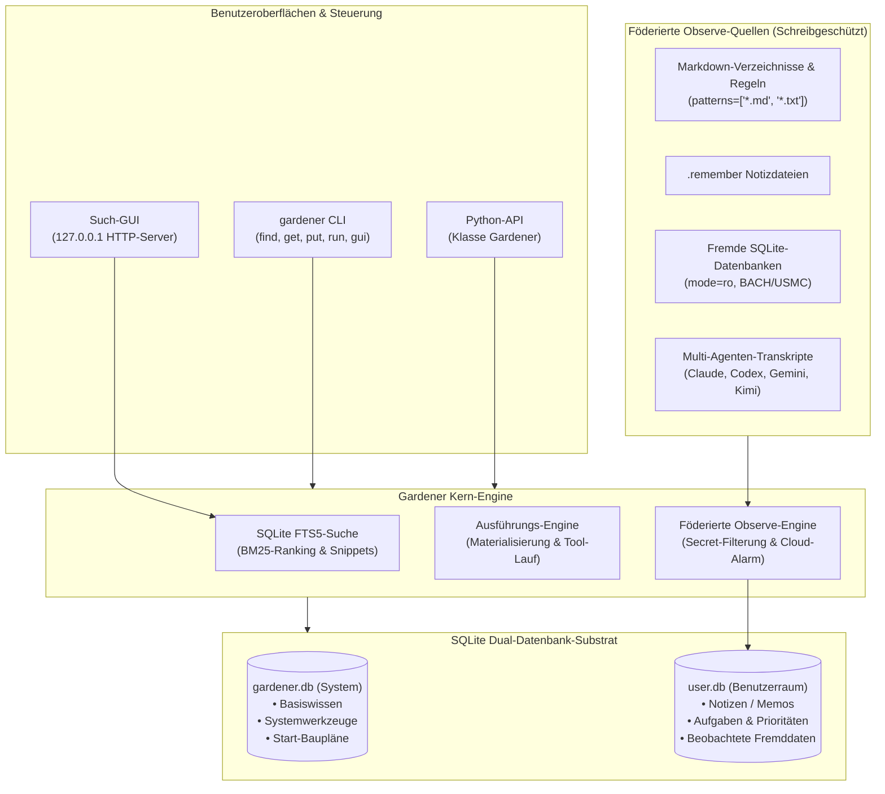
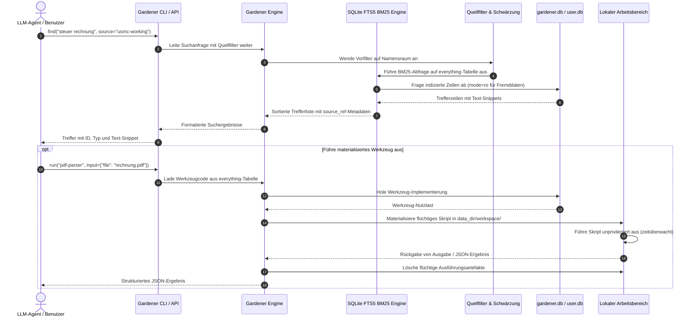

<p align="center">
  
</p>

# gardener — Gepflegte Memory für agentische Systeme

[](https://github.com/ellmos-ai/gardener/actions/workflows/ci.yml)
[](https://github.com/ellmos-ai/gardener)
[](https://github.com/astral-sh/ruff)
[](https://www.python.org/)
[](https://github.com/ellmos-ai/gardener)
[](LICENSE)
[](https://github.com/ellmos-ai/gardener)
[](THIRD_PARTY_LICENSES.md)
[](SECURITY.md)
[](SECURITY.md)
[](https://github.com/ellmos-ai/gardener)
[](https://github.com/ellmos-ai)
[](https://github.com/open-bricks)
[](llms.txt)

> [!NOTE]
> **LLM / Agenten-Integration**: Gardener stellt ein Ein-Tabellen-FTS5-SQLite-Substrat (`gardener.db` / `user.db`) mit den Primitiven `find`, `get`, `put` und `run` bereit. Siehe [`llms.txt`](llms.txt) für maschinenlesbare Spezifikationen.

**🇬🇧 [English Version](README.md)** | **🛡️ [Sicherheitsrichtlinie](SECURITY.md)** | **📜 [Drittanbieter-Lizenzen](THIRD_PARTY_LICENSES.md)** | **📝 [Changelog](CHANGELOG.md)** | **📋 [llms.txt](llms.txt)** | **📊 [Marketing-Log](MARKETING-LOG.txt)**

> Status: Prototyp (v0.4.2) | Autor: Lukas Geiger + Claude

---

## 🧭 Schnellnavigation

| # | Abschnitt (DE) | Section (EN) | Sprungmarke |
|---|---|---|---|
| 01 | [Funktionen & Kernprimitive](#1-funktionen) | [Features & Core Primitives](#1-features) | [`#1-funktionen`](#1-funktionen) |
| 02 | [Systemarchitektur](#2-architektur) | [System Architecture](#2-architecture) | [`#2-architektur`](#2-architektur) |
| 03 | [Zielgruppen & Auffindbarkeit](#3-zielgruppen--auffindbarkeit) | [Target Personas & Discoverability](#3-target-personas--discoverability) | [`#3-zielgruppen--auffindbarkeit`](#3-zielgruppen--auffindbarkeit) |
| 04 | [Vergleichsmatrix vs. Alternativen](#4-vergleichsmatrix-vs-alternativen) | [Comparative Matrix vs. Alternatives](#4-comparative-matrix-vs-alternatives) | [`#4-vergleichsmatrix-vs-alternativen`](#4-vergleichsmatrix-vs-alternativen) |
| 05 | [Duale Mermaid-Diagramme](#5-duale-mermaid-diagramme) | [Dual Mermaid Diagrams](#5-dual-mermaid-diagrams) | [`#5-duale-mermaid-diagramme`](#5-duale-mermaid-diagramme) |
| 06 | [Governance & Laufzeit-Invarianten](#6-governance--laufzeit-invarianten) | [Governance & Runtime Invariants](#6-governance--runtime-invariants) | [`#6-governance--laufzeit-invarianten`](#6-governance--laufzeit-invarianten) |
| 07 | [Datenmodell & Everything-Substrat](#7-datenmodell--everything-substrat) | [Data Model & Everything Substrate](#7-data-model--everything-substrate) | [`#7-datenmodell--everything-substrat`](#7-datenmodell--everything-substrat) |
| 08 | [Duales SQLite-Substrat & FTS5-BM25](#8-sqlite-substrat--fts5-engine) | [Dual SQLite Substrate & FTS5 BM25 Engine](#8-sqlite-substrate--fts5-engine) | [`#8-sqlite-substrat--fts5-engine`](#8-sqlite-substrat--fts5-engine) |
| 09 | [Such-GUI & Web-Oberfläche](#9-such-gui--web-oberflaeche) | [Search GUI & Web Companion](#9-search-gui--web-companion) | [`#9-such-gui--web-oberflaeche`](#9-such-gui--web-oberflaeche) |
| 10 | [Installation & Schnellstart](#10-installation--schnellstart) | [Installation & Quickstart](#10-installation--quickstart) | [`#10-installation--schnellstart`](#10-installation--schnellstart) |
| 11 | [CLI & Headless-Automation](#11-cli--headless-automation) | [CLI & Headless Automation](#11-cli--headless-automation) | [`#11-cli--headless-automation`](#11-cli--headless-automation) |
| 12 | [Einheitliches Task- & Memory-Management](#12-einheitliches-task--memory-management) | [Unified Task & Memory Management](#12-unified-task--memory-management) | [`#12-einheitliches-task--memory-management`](#12-einheitliches-task--memory-management) |
| 13 | [Dateilebenszyklus: Absorb, Materialize & Sync](#13-dateilebenszyklus-absorb-materialize--sync) | [File Lifecycle: Absorb, Materialize & Sync](#13-file-lifecycle-absorb-materialize--sync) | [`#13-dateilebenszyklus-absorb-materialize--sync`](#13-dateilebenszyklus-absorb-materialize--sync) |
| 14 | [Föderierte Quellen & Secret-Schwärzung](#14-foederierte-quellen--secret-schwaerzung) | [Federated Sources & Secret Redaction](#14-federated-sources--secret-redaction) | [`#14-foederierte-quellen--secret-schwaerzung`](#14-foederierte-quellen--secret-schwaerzung) |
| 15 | [Architekturvergleich: Gardener vs. Rinnsal](#15-gardener-vs-rinnsal) | [Architectural Comparison: Gardener vs. Rinnsal](#15-gardener-vs-rinnsal) | [`#15-gardener-vs-rinnsal`](#15-gardener-vs-rinnsal) |
| 16 | [Tests & Qualitätssicherung](#16-tests--qualitaetssicherung) | [Testing & Quality Verification](#16-testing--quality-verification) | [`#16-tests--qualitaetssicherung`](#16-tests--qualitaetssicherung) |
| 17 | [Drittanbieter-Lizenzen & Software-Inventar](#17-drittanbieter-lizenzen--software-inventar) | [Third-Party Licenses & Software Inventory](#17-third-party-licenses--software-inventory) | [`#17-drittanbieter-lizenzen--software-inventar`](#17-drittanbieter-lizenzen--software-inventar) |
| 18 | [Sicherheitsrichtlinie, Geschwister-Ökosystem & Haftungshinweis](#18-sicherheitsrichtlinie-geschwister-oekosystem--haftung) | [Security Policy, Sibling Ecosystem & Liability Notice](#18-security-policy-sibling-ecosystem--liability) | [`#18-sicherheitsrichtlinie-geschwister-oekosystem--haftung`](#18-sicherheitsrichtlinie-geschwister-oekosystem--haftung) |

---

<a id="1-funktionen"></a><a id="1-features"></a><a id="funktionen"></a><a id="features"></a><a id="was-ist-gardener"></a><a id="what-is-gardener"></a>
## 1. Funktionen & Kernprimitive

Ein Betriebssystem, das speziell für LLMs entwickelt wurde. Alles lebt in einer durchsuchbaren SQLite-Datenbank. Vier Grundfunktionen genügen für die gesamte Agenten-Interaktion:

- **`find(query, ...)`**: Volltextsuche mit deterministischem FTS5-BM25-Ranking, Snippet-Extraktion und Namensraum-Filtern über Erinnerungen, Aufgaben, Wissen und Werkzeuge.
- **`get(name)`**: Abruf von Einträgen anhand von Schlüssel oder Pfad zur Inspektion von Metadaten und Nutzlasten.
- **`put(name, content, ...)`**: Dauerhafte Speicherung von Notizen, Lektionen, Aufgaben, Dokumenten oder Werkzeugen direkt in SQLite.
- **`run(name, input=...)`**: Flüchtige Materialisierung und Ausführung von Python-Tools im unprivilegierten Benutzerraum.
- **100% Offline & Zero-Egress**: Reine Ausführung über die Python-Standardbibliothek ohne Netzwerk-Telemetrie oder externe Tracking-Dienste.
- **Duales SQLite-Substrat**: Physische Trennung zwischen System-Bauplänen (`gardener.db`) und Benutzer-Zustand (`user.db`).
- **Föderierte Quellen-Beobachtung**: Live-Indizierung von Agenten-Transkripten, Markdown-Verzeichnissen, `.remember`-Dateien und externen SQLite-Tabellen ohne Veränderung der Originale.
- **Automatische Secret-Schwärzung**: Schutz vor Datenlecks durch automatische Schwärzung von 13 Anmeldedaten-Familien vor dem Indizieren sowie Cloud-Leak-Erkennung.

---

<a id="2-architektur"></a><a id="2-architecture"></a><a id="architektur"></a><a id="architecture"></a>
## 2. Systemarchitektur

Gardener ersetzt fragmentierte Microservice-Gedächtnisse durch ein einzelnes, hocheffizientes SQLite-Substrat:

```
Gardener/
  gardener.py          # Kernklasse Gardener + CLI-Steuerung
  sources.py           # Schreibgeschützte Adapter für beobachtete Fremdquellen
  seed.py              # Initiales Systemwissen & Referenzquellen
  search_gui.py        # Lokale Zero-Egress Web-Oberfläche (127.0.0.1)
  i18n.py              # CLI-Internationalisierung & Sprachkatalog
  locales/             # Übersetzungsdateien (DE / EN)
  tests/               # Vollständige automatisierte Vertragstest-Suite
  KONZEPT.md           # Umfassendes deutsches Architekturkonzept
  README.md            # Kanonische englische Spezifikation
  README_de.md         # Kanonische deutsche Dokumentation
  THIRD_PARTY_LICENSES.md # Vollständiges Software-Inventar & SPDX-SBOM
  workspace/           # Flüchtige Sandbox für materialisierte Werkzeugausführung
  blobs/               # Lokale Ablage für große Dateien (>50MB)

Lokale Datenablage (Local-First, anpassbar mit GARDENER_DATA):
  ~/.gardener/
    gardener.db        # System-Substrat: Basiswissen, Werkzeuge, Baupläne
    user.db            # Benutzer-Substrat: Notizen, Aufgaben, beobachtete Fremddaten
    blobs/             # Große lokale Binärdateien

Benutzer-Sync-Ordner (Cloud-fähig, anpassbar mit GARDENER_HOME):
  ~/gardener/
    .absorber/         # Eingangsordner: Automatische Übernahme in die DB
    .output/           # Ausgabeverzeichnis: Materialisierte Dateien aus der DB
    documents/         # Beobachtetes Dokumentenverzeichnis (LLM liest mit)
```

---

<a id="3-zielgruppen--auffindbarkeit"></a><a id="3-target-personas--discoverability"></a><a id="zielgruppen"></a><a id="target-personas"></a><a id="suchkontext"></a><a id="discovery-context"></a>
## 3. Zielgruppen & Auffindbarkeit

### Zielgruppen (Personas)

- **`[PERSONA-01]` Local-First KI-Agenten-Entwickler**: Ingenieure, die autonome Agentensysteme (Claude Code, AutoGen, CrewAI, LangChain) bauen und langlebiges, latenzarmes, 100% offline-fähiges Gedächtnis ohne externe API-Abhängigkeiten oder Vektor-Drift benötigen.
- **`[PERSONA-02]` Datenschutzorientierte Forscher & Wissensarbeiter**: Wissenschaftler, Analysten und Juristen, die Dokumenten-Indizierung, Transkript-Recherche und automatische Secret-Filterung ohne Cloud-Datenabfluss verlangen.
- **`[PERSONA-03]` Multi-Agenten-Flotten-Architekten**: Systemarchitekten für Agenten-Schwärme, die sitzungsübergreifende Konsolidierung, gemeinsame Aufgaben-Priorisierung und sichere temporäre Werkzeug-Ausführung koordinieren.
- **`[PERSONA-04]` SQLite- & Local-Tooling-Enthusiasten**: Entwickler, die minimalistische Architekturen schätzen, in denen sämtlicher Zustand (Tools, Gedächtnis, Aufgaben, Wissen) in einer erprobten SQLite-Datei statt in Microservices liegt.

### Suchphrasen & Auffindbarkeit

Verwende die kanonische Kennung `ellmos-ai/gardener`, um das Repository gezielt aufzufinden. Der Kurzbegriff `gardener` kollidiert mit Gartenbau-Websites, botanischen Projekten und Sesamstraße-Suchergebnissen.

```text
ellmos-ai/gardener
sqlite llm operating system
local-first agent memory substrate
offline fts5 agent knowledge base
zero egress multi-agent memory
ellmos-ai gardener sqlite
deterministic agent memory bm25
unprivileged agent tool workspace
```

---

<a id="4-vergleichsmatrix-vs-alternativen"></a><a id="4-comparative-matrix-vs-alternatives"></a><a id="comparative-matrix"></a>
## 4. Vergleichsmatrix vs. Alternativen

| Dimension | Invariante | Gardener OS (`ellmos-ai/gardener`) | MemGPT / Letta | LangChain / LlamaIndex | ChromaDB / Pinecone | Standard-Dateisystem + Grep |
|---|---|---|---|---|---|---|
| **1. Offline & Zero-Egress** | `INV-LOCAL-01` | **Ja (100% Lokales SQLite)** | Benötigt Server-Dienst / API | Cloud-API-Wrapper typisch | Vektor-API / Telemetrie | Ja (Lokale Festplatte) |
| **2. Unprivilegierte Sicherheit** | `INV-RUNAS-02` | **Ja (`RunAsInvoker` User-Modus)** | Container / Root-Dienst | Prozessabhängig | Prozessabhängig | Nutzerabhängig |
| **3. Gedächtnis- & Such-Engine** | `INV-FTS-03` | **SQLite FTS5 BM25 Engine** | Vektor-DB + LLM-Tiering | Vektor-Store-Wrapper | Dichte Embeddings (Drift) | Grep / Regex (Unsortiert) |
| **4. Secret-Schwärzung** | `INV-SEC-04` | **Ja (13 Credential-Familien)** | Nein (Speichert Rohdaten) | Nein (Zusatztool nötig) | Nein (Speichert Rohdaten) | Keine (Rohdaten) |
| **5. Cloud-Leak-Erkennung** | `INV-CLOUD-05` | **Ja (Idempotenter Cloud-Alarm)** | Nein | Nein | Nein | Keine |
| **6. Externe Quell-Isolation** | `INV-RO-06` | **Ja (`mode=ro` DBs + Globs)** | Nein (Einzelne Haupt-DB) | Variiert | Dedizierte Vektor-DB | Geteilter Lese-/Schreibzugriff |
| **7. Ausführungsgrenze** | `INV-TRAV-07` | **Ja (Isoliertes Workspace)** | Docker / Subprozesse | Code-Interpreter-Agenten | Keine (Nur Vektorsuche) | Direkte Shell-Ausführung |
| **8. Einheitliches Substrat** | `INV-SUB-08` | **Ja (Ein-Tabellen-Substrat)** | Mehrere Tabellen + DBs | Zersplitterte Speicher | Nur Vektoren (Keine Tools) | Fragmentierte Dateien |
| **9. Dokumentations-Parität** | `INV-DOCS-09` | **Ja (18 Pkte DE/EN + `llms.txt`)** | Nur englische Dokumentation | Nur englische Dokumentation | Nur englische Dokumentation | Fragmentierte Doku |
| **10. Open Governance & SLA** | `INV-SLA-10` | **MIT (48h Antwort / 5d Triage)** | Apache-2.0 / Kommerziell | MIT / Kommerziell | Apache-2.0 / Proprietär | Variiert |

---

<a id="5-duale-mermaid-diagramme"></a><a id="5-dual-mermaid-diagrams"></a><a id="dual-mermaid-diagrams"></a><a id="end-to-end-abfrage---ausführungs-lebenszyklus"></a><a id="end-to-end-query--execution-lifecycle"></a>
## 5. Duale Mermaid-Diagramme

### Systemarchitektur & Datenfluss


```mermaid
flowchart TD
    subgraph UI ["Benutzeroberflächen & Steuerung"]
        CLI["gardener CLI<br/>(find, get, put, run, gui)"]
        API["Python-API<br/>(Klasse Gardener)"]
        GUI["Such-GUI<br/>(127.0.0.1 HTTP-Server)"]
    end

    subgraph CORE ["Gardener Kern-Engine"]
        FTS["SQLite FTS5-Suche<br/>(BM25-Ranking & Snippets)"]
        EXEC["Ausführungs-Engine<br/>(Materialisierung & Tool-Lauf)"]
        OBS["Föderierte Observe-Engine<br/>(Secret-Filterung & Cloud-Alarm)"]
    end

    subgraph SUBSTRATE ["SQLite Dual-Datenbank-Substrat"]
        GDB[("gardener.db (System)<br/>• Basiswissen<br/>• Systemwerkzeuge<br/>• Start-Baupläne")]
        UDB[("user.db (Benutzerraum)<br/>• Notizen / Memos<br/>• Aufgaben & Prioritäten<br/>• Beobachtete Fremddaten")]
    end

    subgraph SOURCES ["Föderierte Observe-Quellen (Schreibgeschützt)"]
        S1["Markdown-Verzeichnisse & Regeln<br/>(patterns=['*.md', '*.txt'])"]
        S2[".remember Notizdateien"]
        S3["Fremde SQLite-Datenbanken<br/>(mode=ro, BACH/USMC)"]
        S4["Multi-Agenten-Transkripte<br/>(Claude, Codex, Gemini, Kimi)"]
    end

    CLI --> CORE
    API --> CORE
    GUI --> FTS
    CORE --> SUBSTRATE
    SOURCES --> OBS --> UDB
```

### End-to-End Abfrage- & Ausführungs-Lebenszyklus

Das folgende Sequenzdiagramm veranschaulicht, wie Suchanfragen vorgefiltert, via FTS5 BM25 bewertet und Werkzeuge flüchtig im unprivilegierten Benutzerraum ausgeführt werden:


```mermaid
sequenceDiagram
    autonumber
    actor Agent as LLM-Agent / Benutzer
    participant CLI as Gardener CLI / API
    participant Core as Gardener Engine
    participant FTS as SQLite FTS5 BM25 Engine
    participant Filter as Quellfilter & Schwärzung
    participant DB as gardener.db / user.db
    participant WS as Lokaler Arbeitsbereich

    Agent->>CLI: find("steuer rechnung", source="usmc-working")
    CLI->>Core: Leite Suchanfrage mit Quellfilter weiter
    Core->>Filter: Wende Vorfilter auf Namensraum an
    Filter->>FTS: Führe BM25-Abfrage auf everything-Tabelle aus
    FTS->>DB: Frage indizierte Zeilen ab (mode=ro für Fremddaten)
    DB-->>FTS: Trefferzeilen mit Text-Snippets
    FTS-->>Core: Sortierte Trefferliste mit source_ref-Metadaten
    Core-->>CLI: Formatierte Suchergebnisse
    CLI-->>Agent: Treffer mit ID, Typ und Text-Snippet

    opt Führe materialisiertes Werkzeug aus
        Agent->>CLI: run("pdf-parser", input={"file": "rechnung.pdf"})
        CLI->>Core: Lade Werkzeugcode aus everything-Tabelle
        Core->>DB: Hole Werkzeug-Implementierung
        DB-->>Core: Werkzeug-Nutzlast
        Core->>WS: Materialisiere flüchtiges Skript in data_dir/workspace/
        WS->>WS: Führe Skript unprivilegiert aus (zeitüberwacht)
        WS-->>Core: Rückgabe von Ausgabe / JSON-Ergebnis
        Core->>WS: Lösche flüchtige Ausführungsartefakte
        Core-->>Agent: Strukturiertes JSON-Ergebnis
    end
```

---

<a id="6-governance--laufzeit-invarianten"></a><a id="6-governance--runtime-invariants"></a><a id="governance--laufzeit-invarianten"></a><a id="governance--runtime-invariants"></a>
## 6. Governance & Laufzeit-Invarianten

Gardener garantiert 10 strikte architektonische Prinzipien für den sicheren, lokalen Betrieb von LLM-Agenten:

| # | Invariante | Beschreibung | Durchsetzungsebene |
|---|---|---|---|
| 1 | **`INV-LOCAL-01` 100% Offline / Zero-Egress** | Ausschließlich lokale SQLite-Ausführung (`~/.gardener/user.db`, `~/.gardener/gardener.db`). Keine Telemetrie, keine externen API-Aufrufe. | Architektonische Garantie |
| 2 | **`INV-RUNAS-02` Unprivilegierter User-Modus (`RunAsInvoker`)** | Ausschließlich unprivilegierte Ausführung; keine Administrator- oder Root-Rechte erforderlich. | Prozess-Sicherheitsgate |
| 3 | **`INV-FTS-03` FTS5 BM25 Assoziativ-Gedächtnis** | Deterministisches Ranking und Snippet-Generierung ohne Vektor-Drift oder externe Embedding-Modelle. | Kern-Such-Engine |
| 4 | **`INV-SEC-04` Automatische Secret-Schwärzung** | 13 Anmeldedaten-Familien (GitHub PATs, AWS Keys, Anthropic/OpenAI Keys, Bearer Tokens, PEM-Keys) werden vor dem Indizieren geschwärzt. | Vor-Indizierungs-Gate |
| 5 | **`INV-CLOUD-05` Cloud-Leak-Erkennung** | Signaturen in Cloud-synchronisierten Ordnern (`~/OneDrive`) erzeugen idempotente Warnungen in `GARDENER_CLOUD_ALERT_FILE` ohne Werte zu speichern. | Echtzeit-Datenschutzalarm |
| 6 | **`INV-RO-06` Schreibgeschützte Fremdquellen** | Externe Quellen (BACH Wiki, Agenten-Transkripte, Markdown-Dateien) werden strikt mit `mode=ro` gelesen. | Read-Only-Datenbankisolation |
| 7 | **`INV-TRAV-07` Pfad-Sicherheit & Workspace-Isolation** | `materialize()` und `absorb()` bereinigen Dateinamen und blockieren Pfad-Traversal (`../`, absolute Pfade). | Dateisystem-Sicherheitsgrenze |
| 8 | **`INV-SUB-08` Einheitliches Everything-Substrat** | Eine einzige `everything`-Tabelle für Wissen, Werkzeuge, Notizen, Aufgaben und Dokumente auf zwei SQLite-Dateien. | Substrat-Architektur |
| 9 | **`INV-DOCS-09` Zweisprachige Dokumentationsparität** | 100% Parität zwischen englischer und deutscher Dokumentation sowie Vertragstests zur Einhaltung aller Invarianten. | Test-Suite-Absicherung |
| 10 | **`INV-SLA-10` Open-Source-Governance & SLA** | Freie MIT-Lizenz, transparente GitHub-Verwaltung und verbindliches 48h-Erstkontakt- / 5-Tage-Triage-Sicherheits-SLA. | Community-Verpflichtung |

---

<a id="7-datenmodell--everything-substrat"></a><a id="7-data-model--everything-substrate"></a><a id="datenmodell"></a><a id="data-model"></a>
## 7. Datenmodell & Everything-Substrat

Eine einheitliche Tabelle für (fast) alles:

| Typ | Beschreibung | Ziel-Substrat | Lebenszyklus & Zerfall |
|---|---|---|---|
| `knowledge` | Kuratiertes Wissen, Dokumentation, Regeln | `gardener.db` | Dauerhaft, geschützt |
| `tool` | Ausführbare Skripte und Automationsprimitive | `gardener.db` | Dauerhaft, ausführbar |
| `memory` | Kurzzeitnotizen, Arbeitsspeicher | `user.db` | Schneller exponentieller Zerfall |
| `lesson` | Destillierte Einsichten und Best Practices | `user.db` | Hohe Persistenz, langsamer Zerfall |
| `task` | Aufgaben, Prioritäten und Fälligkeiten | `user.db` | Statusgesteuert (`open`/`done`) |
| `document` | In die Datenbank absorbierte Dateien | `user.db` | Bei Bedarf |
| `observed` | Beobachtete fremde Dokumente & Transkripte | `user.db` | Aktualisierbarer föderierter Index |
| `config` | Konfigurationsparameter | `user.db` | Systemeinstellungen |
| `export` | Zur Dateisystem-Materialisierung markiert | `user.db` | Auslieferung ins Workspace |

---

<a id="8-sqlite-substrat--fts5-engine"></a><a id="8-sqlite-substrate--fts5-engine"></a><a id="sqlite-substrat"></a><a id="sqlite-substrate"></a>
## 8. Duales SQLite-Substrat & FTS5-BM25

Gardener trennt System-Baupläne physisch vom Benutzerzustand über zwei getrennte SQLite-Dateien:

1. **System-Substrat (`gardener.db`)**: Beinhaltet Systemwissen, Werkzeuge und Start-Konfigurationen.
2. **Benutzer-Substrat (`user.db`)**: Beinhaltet persönliche Notizen, Lektionen, Aufgaben, Dokumente und den beobachteten Fremd-Index.

### Deterministische BM25-Suche & SQL-Level Pinning

Gardener nutzt die SQLite-eigene FTS5-Volltext-Engine mit BM25-Sortierung und optimiertem SQL-Sorting:
```sql
SELECT ... FROM everything WHERE ... ORDER BY pinned DESC, rank LIMIT ?
```
Angeheftete Einträge (`pinned = 1`) werden direkt auf Datenbankebene an die Spitze gereiht, sodass kritische Kontextinformationen niemals durch Trefferüberhänge abgeschnitten werden.

---

<a id="9-such-gui--web-oberflaeche"></a><a id="9-search-gui--web-companion"></a><a id="such-gui"></a><a id="search-gui"></a>
## 9. Such-GUI & Web-Oberfläche

`python gardener.py gui` startet eine leichtgewichtige, installationsfreie lokale Weboberfläche:

- **100% Offline & Privat**: Bindet strikt nur an `127.0.0.1`.
- **Reine Standardbibliothek**: Basiert auf `http.server` ohne externe npm-Pakete oder CDN-Abhängigkeiten.
- **Garantiert schreibgeschützt**: Schließt jegliche Mutation an `gardener.db` oder `user.db` aus.
- **Interaktive Inspektion**: Suchfeld, Typ-Filterung (`memory`, `task`, `observed`), Anheft-Indikatoren, Snippet-Hervorhebung und JSON-Detailansicht.

```bash
# Startet die lokale GUI auf Standardport 8420
python gardener.py gui

# Start auf eigenem Port ohne automatisches Browser-Öffnen
python gardener.py gui --port 8080 --no-browser
```

---

<a id="10-installation--schnellstart"></a><a id="10-installation--quickstart"></a><a id="schnellstart"></a><a id="quickstart"></a>
## 10. Installation & Schnellstart

Gardener erfordert Python ab Version 3.10 und keinerlei externe Zusatzpakete:

```bash
# Repository klonen
git clone https://github.com/ellmos-ai/gardener.git
cd gardener

# Systemwissen und Standard-Quellen einpflegen
python seed.py
```

### Python-API Schnellstart

```python
from gardener import Gardener

# Empfohlen: Nutzung als Context Manager für garantiertes Schließen von Verbindungen
with Gardener() as af:
    # Suche über Notizen, Aufgaben und Dokumente
    results = af.find("rechnung")
    for hit in results:
        print(f"[{hit['type']}] {hit['name']}: {hit['content'][:60]}")

    # Eintrag gezielt auslesen
    doc = af.get("receipt-scanner")

    # Neue Arbeitsnotiz anlegen
    af.put("projekt-meeting", content="SQLite-Substrat besprechen", type="memory", tags="meeting")

    # Ein registriertes Werkzeug ausführen
    af.run("file-info", input={"path": "README_de.md"})
```

---

<a id="11-cli--headless-automation"></a><a id="11-cli--headless-automation"></a><a id="cli"></a>
## 11. CLI & Headless-Automation

```bash
# Kernoperationen
python gardener.py find <query>
python gardener.py find --pinned <query>
python gardener.py find --source <source_id> <query>
python gardener.py get <name>
python gardener.py put <name> <text>
python gardener.py run <name> [input_json]

# Dateiverwaltung
python gardener.py absorb <datei>
python gardener.py materialize <name>
python gardener.py sync

# Gedächtnis- und Aufgabenverwaltung
python gardener.py memo <text>
python gardener.py lesson <titel> [text]
python gardener.py recall <query>
python gardener.py consolidate
python gardener.py session-end <text>
python gardener.py task <name> [text]
python gardener.py tasks [status]
python gardener.py done <name>

# Föderierte Beobachtungsquellen
python gardener.py observe
python gardener.py observe-source list
python gardener.py observe-source add <id> <art> [key=value ...]
python gardener.py observe-source refresh [id]
python gardener.py observe-source remove <id>

# Systeminspektion & Weboberfläche
python gardener.py status
python gardener.py gui [--port N] [--no-browser]
```

Die CLI-Hilfe ist standardmäßig deutsch. Mit `GARDENER_LANG=en` wird die englische Hilfe ausgegeben.

---

<a id="12-einheitliches-task--memory-management"></a><a id="12-unified-task--memory-management"></a><a id="memory-no-separate-memory-system"></a><a id="memory-kein-separates-gedaechtnis-system"></a><a id="memory-kein-separates-gedächtnis-system"></a><a id="tasks-no-separate-system"></a><a id="tasks-kein-separates-system"></a>
## 12. Einheitliches Task- & Memory-Management

### Assoziatives Gedächtnis ohne separate Vektor-Datenbank

Anstelle separater Vektordatenbanken und Embedding-Pipelines liegt alles in der `everything`-Tabelle. Die FTS5-Volltextsuche **ist** das assoziative Gedächtnis.

```python
af.memo("Kurze Arbeitsnotiz")             # Schneller exponentieller Zerfall
af.lesson("SQLite Concurrency", "Nutze WAL") # Wichtige Einsicht (kaum Zerfall)
af.session_end("Sitzung abgeschlossen")   # Sitzungsbericht
af.recall("concurrency")                  # Durchsucht und verstärkt Relevanzgewicht
af.consolidate()                          # Schlafphase: Lässt Unwichtiges verblassen
```

### Einheitlicher Aufgabenlebenszyklus

Aufgaben sind Zeilen vom Typ `task` in der Tabelle `everything`. Eine einzige Abfrage `find("steuer")` findet gleichzeitig relevantes Wissen, Dokumente und Aufgaben:

```python
af.task("steuer-2025", content="Steuererklärung einreichen", priority="high", due="2026-05-31")
af.tasks()                     # Alle Aufgaben auflisten
af.tasks(status="open")        # Nur offene Aufgaben
af.task_done("steuer-2025")    # Aufgabe abschließen
```

---

<a id="13-dateilebenszyklus-absorb-materialize--sync"></a><a id="13-file-lifecycle-absorb-materialize--sync"></a><a id="drei-beziehungen-zu-dateien"></a><a id="three-relationships-with-files"></a>
## 13. Dateilebenszyklus: Absorb, Materialize & Sync

Gardener unterscheidet drei klare Beziehungen zu Dateien:

1. **Beobachten (Observe):** Datei bleibt im Ordner; Gardener liest und indiziert schreibgeschützt mit.
2. **Absorbieren (Absorb):** Datei wird in die SQLite-Datenbank überführt und als `document`-Zeile abgelegt.
3. **Direktes Bearbeiten / Materialisieren:** Datenbankinhalte werden bei Bedarf zur Ausführung oder Bearbeitung in `workspace/` als Dateien erzeugt.

```python
af.absorb("/pfad/zur/rechnung.pdf")  # Datei → DB (Dematerialisierung)
af.materialize("rechnung.pdf")       # DB → Datei (Materialisierung im Workspace)
```

---

<a id="14-foederierte-quellen--secret-schwaerzung"></a><a id="14-federated-sources--secret-redaction"></a><a id="quellenübergreifender-föderierter-index"></a><a id="cross-source-federated-index"></a>
## 14. Föderierte Quellen & Secret-Schwärzung

Beobachtungsquellen binden externe Werkzeuge rein lesend an: Originale werden niemals verändert oder verschoben:

| Quelltyp | Was indiziert wird | Wichtigste Konfigurationsparameter |
|---|---|---|
| `markdown_dir` | Verzeichnisse mit Markdown- und Textdateien. Unterstützt Verzeichnis-Globs, Ausschlussmuster und Zusatz-Tags. | `path`, `patterns` (Standard `["*.md"]`), `exclude_patterns`, `extra_tags` |
| `remember_files` | `.remember`-Notizdateien verteilt über Projektunterordner. | `path`, `glob` (Standard `**/.remember`) |
| `sqlite_table` | Tabelle in fremder SQLite-Datenbank, strikt schreibgeschützt geöffnet (`mode=ro`). | `db_path`, `table`, `columns` (`content`, `id`, `tags`) |
| `agent_transcripts` | JSONL-Transkripte von Coding-Agenten (nur Textbeiträge). Integrierte Parser für Claude Code, Codex, Gemini Antigravity und Kimi. | `path`, `format`, `key_by`, `zip_inner` |

### Automatische Secret-Schwärzung

Jeder eingelesene Text durchläuft vor dem Speichern `sources.scan()`, wo 13 Anmeldedaten-Familien automatisch unkenntlich gemacht werden:
- GitHub PATs und Fine-Grained Tokens
- AWS Access Key IDs
- Anthropic- und OpenAI-API-Schlüssel
- Slack Webhook-URLs und Bot-Tokens
- Google API Keys und GitLab Access Tokens
- NPM Autorisierungs-Tokens (`npm_***REDACTED***`)
- Bearer Tokens (`Authorization: Bearer ***REDACTED***`)
- Private RSA/EC PEM-Blöcke

**Cloud-Leak-Alarmierung**: Werden Credential-Muster in einem Cloud-synchronisierten Ordner (`~/OneDrive`) entdeckt, wird ein Eintrag ohne den Geheimwert in `GARDENER_CLOUD_ALERT_FILE` abgelegt.

---

<a id="15-gardener-vs-rinnsal"></a><a id="15-vergleich-gardener-vs-rinnsal"></a><a id="vergleich-gardener-vs-rinnsal"></a><a id="comparison-gardener-vs-rinnsal"></a>
## 15. Architekturvergleich: Gardener vs. Rinnsal

Gardener und [Rinnsal](https://github.com/ellmos-ai/rinnsal) verkörpern zwei komplementäre Betriebssystem-Konzepte innerhalb des ellmos-ai-Ökosystems:

| Eigenschaft | Detail | **Gardener** | **Rinnsal** |
|---|---|---|---|
| **Kern-API** | Stil | 4 Primitive (`find`/`get`/`put`/`run`) | ~20 modulare CLI-Befehle |
| **Datenmodell** | Tabellen | 1 (`everything` + Typfeld) | 4+ (Fakten, Notizen, Lektionen, Sessions) |
| | FTS5-Suche | Ja (Kernbestandteil; IST das Gedächtnis) | Nein (strukturierte Abfragen) |
| **Gedächtnis** | Arbeitsspeicher | `memo()` mit exponentiellem Zerfall | `notes` (sitzungsbezogen) |
| | Langzeitwissen | `lesson()` mit Relevanzgewichtung | `facts` (Konfidenzwert) |
| | Konsolidierung | `consolidate()` (Zerfall + Aufräumen) | Nein |
| | Abruf/Verstärkung| `recall()` verstärkt Relevanz | Nein |
| **Aufgaben** | Prioritäten | Ja (Metadatenfeld) | kritisch / hoch / mittel / niedrig |
| | Fälligkeiten | Ja (`due`-Feld) | Nein |
| **Dateien** | Absorb (Datei → DB) | Ja | Nein |
| | Materialize (DB → Datei)| Ja | Nein |
| | Observe (Beobachten) | Ja | Nein |
| **Architektur** | Laufzeitabhängigkeiten | **Null (Python Standardbibliothek)** | **Null (Python Standardbibliothek)** |
| | Philosophie | Radikaler Minimalismus (1 Tabelle, suchzentriert) | Strukturierter Event-Bus, Pipelines & Kanäle |

---

<a id="16-tests--qualitaetssicherung"></a><a id="16-testing--quality-verification"></a><a id="tests"></a><a id="testing"></a>
## 16. Tests & Qualitätssicherung

Gardener verfügt über eine zu 100% bestandene Test-Suite mit Multi-OS- und Multi-Version-Abdeckung:

```bash
# Tests mit Pythons integriertem unittest ausführen
python -m unittest discover -s tests -v

# Tests mit pytest ausführen
pytest -ra -v

# Code-Stil mit Ruff prüfen
ruff check .

# Syntaxprüfung aller Quellcodedateien
python -m compileall -q .
```

- **Unit- und Funktionstests**: Verifikation von Kernprimitiven, FTS5-BM25-Ranking, SQL-Level-Pinning, Zerfallsmechanismen und CLI-Befehlen.
- **Vertrags- und Metadatentests**: Automatische Prüfung der zweisprachigen Parität, Diagrammintegrität, Governance-Invarianten und Lizenzkonformität.
- **Continuous Integration**: GitHub-Actions-Matrix über **Ubuntu, Windows und macOS** unter **Python 3.10, 3.11, 3.12 und 3.13**.

---

<a id="17-drittanbieter-lizenzen--software-inventar"></a><a id="17-third-party-licenses--software-inventory"></a><a id="drittanbieter-lizenzen"></a><a id="licenses"></a><a id="third-party-licenses"></a>
## 17. Drittanbieter-Lizenzen & Software-Inventar

Gardener OS steht unter der freien und permissiven [MIT-Lizenz](LICENSE).

Detaillierte Lizenzinformationen, die vollständige Software-Stückliste (SBOM), SPDX-Kennungen, `RunAsInvoker`-Nicht-Eskalationsgarantien und der Nachweis über den Ausschluss viraler Copyleft-Lizenzen sind in [THIRD_PARTY_LICENSES.md](THIRD_PARTY_LICENSES.md) dokumentiert.

- **Laufzeit-Abhängigkeiten**: Null externe Pakete (100% Python-Standardbibliothek).
- **Entwicklungswerkzeuge**: `pytest` (MIT), `ruff` (MIT/Apache-2.0), `setuptools` (MIT).
- **Keine Rechteausweitung**: Läuft vollständig im unprivilegierten Benutzerraum (`RunAsInvoker`) ohne Root- oder Adminrechte.

---

<a id="18-sicherheitsrichtlinie-geschwister-oekosystem--haftung"></a><a id="18-security-policy-sibling-ecosystem--liability"></a><a id="sicherheitsmodell-bitte-lesen"></a><a id="security-model-read-this"></a><a id="geschwisterwerkzeuge--ökosystem"></a><a id="sibling-projects--ecosystem"></a><a id="haftung--liability"></a>
## 18. Sicherheitsrichtlinie, Geschwister-Ökosystem & Haftungshinweis

### Sicherheitsmodell & SLA

Gardener ist ein **lokales Werkzeug für Einzelbenutzer mit unprivilegierter Ausführung**. Die Ausführung von Werkzeugen (`run()`) erfolgt mit den Rechten Ihres regulären Benutzerkontos. Absorbieren, speichern und führen Sie nur Inhalte aus, denen Sie vertrauen.

- **Schwachstellenmeldung**: Sicherheitsrelevante Funde bitte vertraulich an [security@ellmos.ai](mailto:security@ellmos.ai) oder über GitHub Security Advisories melden.
- **Sicherheits-SLA**: Garantierte Erstreaktion innerhalb von **48 Stunden** und Triage innerhalb von **5 Werktagen**. Siehe [SECURITY.md](SECURITY.md).

### Geschwisterwerkzeuge & Ökosystem-Matrix

Gardener ist integraler Bestandteil der Ökosysteme **ellmos-ai** und **open-bricks**:

| Repository | Schwerpunkt / Beschreibung | Kategorie |
|---|---|---|
| [ellmos-core](https://github.com/ellmos-ai/ellmos-core) | Modularer Agenten-Ausführungskern & Prompt-Evidenz-Engine | Kern-Framework |
| [clutch](https://github.com/ellmos-ai/clutch) | Universeller Multi-Provider LLM-CLI-Client (Anthropic, Gemini, OpenAI, Ollama) | CLI & Routing |
| [BACH](https://github.com/ellmos-ai/bach) | Dateizentriertes textbasiertes OS für LLMs (Dateisystem-Substrat) | OS-Architektur |
| [USMC](https://github.com/ellmos-ai/usmc) | Universal Shared Memory Core für Multi-Agenten-Zustandspersistenz | Gedächtnis-Substrat |
| [Rinnsal](https://github.com/ellmos-ai/rinnsal) | Leichtgewichtige ereignisgesteuerte Agenten-Infrastruktur | Agenten-Runtime |
| [ellmos-controlcenter-mcp](https://github.com/ellmos-ai/ellmos-controlcenter-mcp) | Zentraler MCP-Tool-Koordinator, Profilverwaltung & dynamisches Routing | MCP-Gateway |
| [ellmos-filecommander-mcp](https://github.com/ellmos-ai/ellmos-filecommander-mcp) | Lokale Dateioperationen, sicherer Papierkorb & zweisprachiger MCP-Server | MCP-Server |
| [ellmos-codecommander-mcp](https://github.com/ellmos-ai/ellmos-codecommander-mcp) | AST-Analyse, Code-Transformation & Refactoring-MCP-Server | MCP-Server |
| [ellmos-clatcher-mcp](https://github.com/ellmos-ai/ellmos-clatcher-mcp) | Strukturierter Zwischenspeicher, Validierungs- & Cache-MCP-Server | MCP-Server |
| [n8n-manager-mcp](https://github.com/ellmos-ai/n8n-manager-mcp) | Lokale Workflow-Verwaltung und Inspektions-MCP-Server | MCP-Server |
| [skills](https://github.com/ellmos-ai/skills) | Kuratierter Multi-Agenten-Skills-Katalog | Skills-Bibliothek |
| [DevCenter](https://github.com/dev-bricks/DevCenter) | Entwickler-Arbeitsbereich-Orchestrierung | Entwickler-Tools |
| [open-bricks](https://github.com/open-bricks) | Dachorganisation für modulare Open-Source-Bausteine | Ökosystem-Dach |

### Haftungsausschluss / Gesetzlicher Hinweis (§ 521 BGB Gefälligkeitsrecht)

Dieses Projekt ist eine **unentgeltliche Open-Source-Schenkung** im Sinne der §§ 516 ff. BGB. Die Haftung des Urhebers ist gemäß **§ 521 BGB** auf **Vorsatz und grobe Fahrlässigkeit** beschränkt. Ergänzend gelten die Haftungsausschlüsse der MIT-Lizenz.

Nutzung auf eigenes Risiko. Keine Wartungszusage, keine Verfügbarkeitsgarantie, keine Gewähr für Fehlerfreiheit oder Eignung für einen bestimmten Zweck.

This project is an unpaid open-source donation. Liability is limited to intent and gross negligence (§ 521 German Civil Code). Use at your own risk. No warranty, no maintenance guarantee, no fitness-for-purpose assumed.
